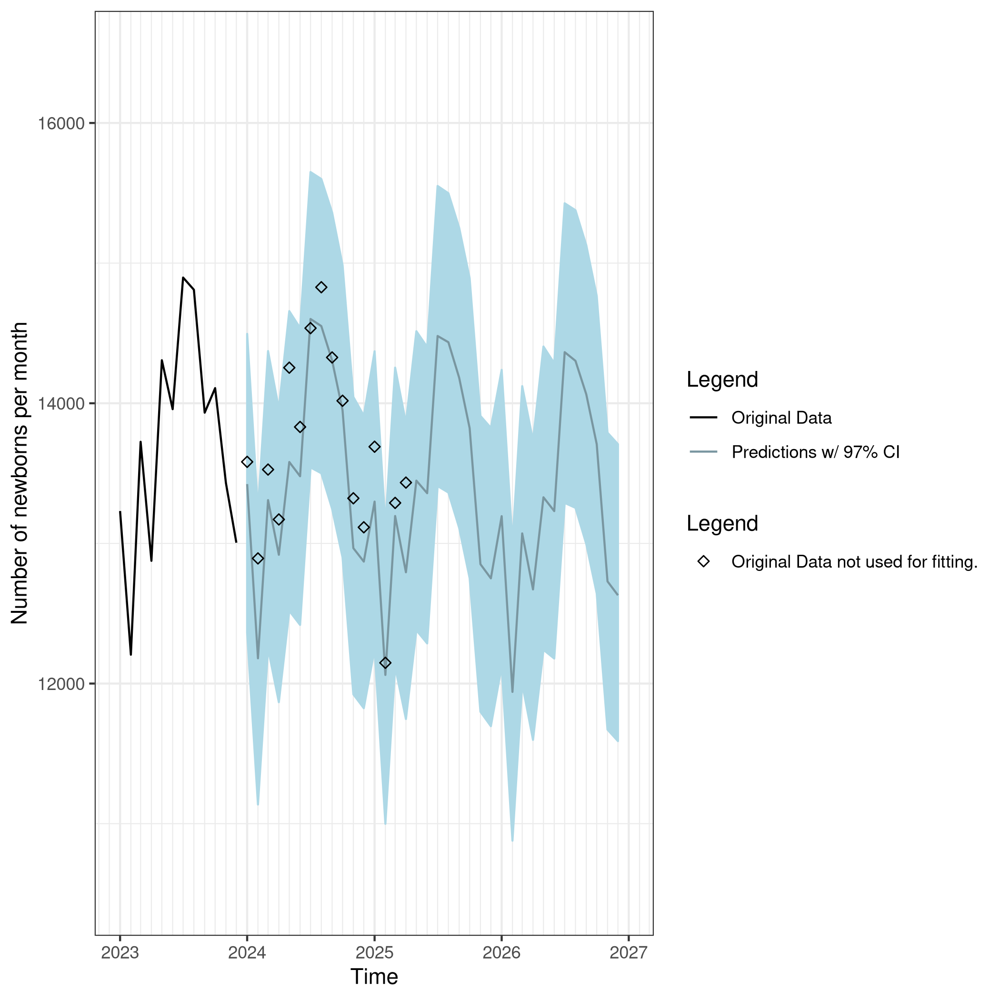

### Creating Environment
This file uses renv as dependency manager and assumes it is installed, if it is not installed please refer to [this website](https://rstudio.github.io/renv/).

The environment can be recovered using ```renv::restore()```.

### Goal
This repository aims to shows how one can pull a dataset using ```cbsodataR```, fit a statistical model to the data using ```rstan```, and plot the results using ```ggplot```. 

### The dataset
The dataset used in this repository is the dataset with ID 37230ned. This is a dataset in Dutch that describes the population growth in the Netherlands.

### Statistical Model
Using the data and ```rstan``` I would like to predict the live child birth in the Netherlands. For the sake of time, I create a fairly simple model, where the child birth of a particular month is distributed according to the normal distribution, with a fixed variance and the mean only dependent on the year and month of the measurement. We know that there is seasonality to child birth so we model that by adding a constant to the model based on the month and we see that the total child birth decreases yearly, so we add a factor that estimates how much the child birth decreases yearly. The model can be written as:

<p align="center">
    
</p>

In this equation, y is the childbirth rate, alpha is the value with which childbirt rate decreases per year, x is the year and beta is a term that is specific for the month and sigma is fixed. This is all modelled in the file called ```bithrate_model.stan```.

### Results
For fitting I used all birthrate data available up to and including 2023. The original data in black and the predictions from the model in lightblue can be seen in the figure below.

<p align="center">
    
</p>

There were some data left that were not used in fitting the model. In the figure below I plot the 97% confidence interval around the predictions. When zooming in and plotting the original data points, we can see that all values fall within this confidence interval.

<p align="center">
    
</p>